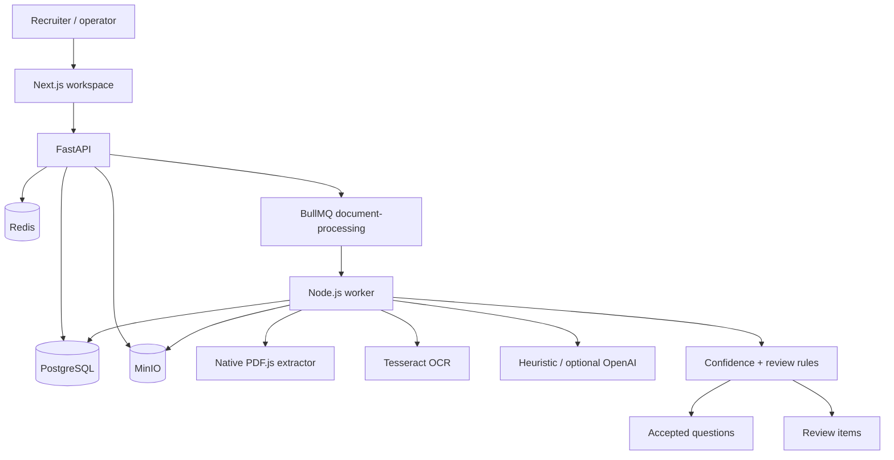

# Architecture

Folio is a modular document-intelligence system. The browser never talks to PostgreSQL, Redis, MinIO, OCR, or extraction engines.



## Frontend

Next.js App Router, TypeScript, Tailwind. Client components are used where polling, uploads, and review actions are required. The UI reads only versioned HTTP APIs.

## API

FastAPI owns authentication, validation, authorization, uploads, job enqueueing, and read models. Requests get a `requestId`. Errors use:

```json
{ "error": { "code": "DOCUMENT_NOT_FOUND", "message": "Document was not found.", "requestId": "..." } }
```

## Database

PostgreSQL stores users, documents, pages, jobs, questions, options, answers, warnings, review items, groups, and relationships. Binaries stay in object storage. Prisma migrations are the source of schema truth.

## Redis and BullMQ

Redis is the job backbone, not a cache of extracted questions. FastAPI enqueues work onto `folio:document-jobs` (and a BullMQ-compatible wait list). The Node worker consumes those jobs concurrently. A malformed document cannot crash the worker process; the job fails and the document is marked `FAILED`.

## Worker

The worker runs a staged pipeline (validation → preprocessing → OCR → structure → questions → answers → validation → persist). Each stage updates `status`, `currentStage`, `progress`, and a `ProcessingJob` row.

## Storage

MinIO is S3-compatible. Originals live under generated keys `documents/{ownerId}/{yyyy}/{mm}/{uuid}.ext`. Derived page previews live under `derived/{documentId}/v{version}/page-n.png` and are replaced on reprocess.

## OCR and AI

Providers are interfaces:

- `DocumentTextExtractor`
- `DocumentVisionProvider`
- `QuestionExtractionProvider`
- `AnswerKeyExtractionProvider`

Wired by `DOCUMENT_TEXT_PROVIDER`, `OCR_PROVIDER`, and `AI_PROVIDER`.

Default `AI_PROVIDER=heuristic` is a deterministic parser. It is labelled as such in Settings and in this document. It is **not** a language model.

## Data flow

1. Authenticated upload is validated and stored.
2. `POST /process` increments `processingVersion`, sets `QUEUED`, and enqueues `{ documentId, processingVersion }`.
3. The worker downloads the object, extracts pages, OCRs only when needed, extracts questions, matches answers, scores confidence, and writes a consistent snapshot in one transaction.
4. The UI polls `/status` and question lists. Refresh is safe; state lives in Postgres.

## Failure handling

| Failure | Behaviour |
| --- | --- |
| Invalid/corrupt PDF | Permanent error, no endless retry |
| Empty / unreadable scan | Permanent error with a specific message |
| OCR / storage / network timeout | Transient, exponential backoff |
| Redis down | Enqueue fails; API returns a structured error |
| Worker crash | BullMQ retries the job; persist is idempotent per version |

## Why these pieces

- **PostgreSQL** — questions, answers, review, and ownership are relational. Transactions keep a processing snapshot consistent.
- **Redis** — reliable queue, not a substitute database.
- **BullMQ** — retries, concurrency, and job identity without operating a custom scheduler.
- **MinIO** — local S3 that can be swapped for cloud object storage.
- **Asynchronous processing** — extraction is slow and bursty; HTTP must stay responsive.
- **Provider abstraction** — OCR/LLM vendors change; the domain model should not.
